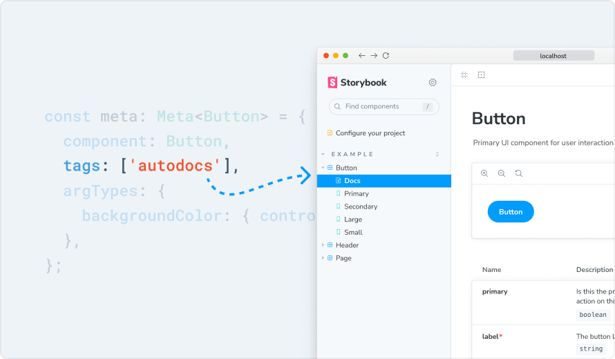
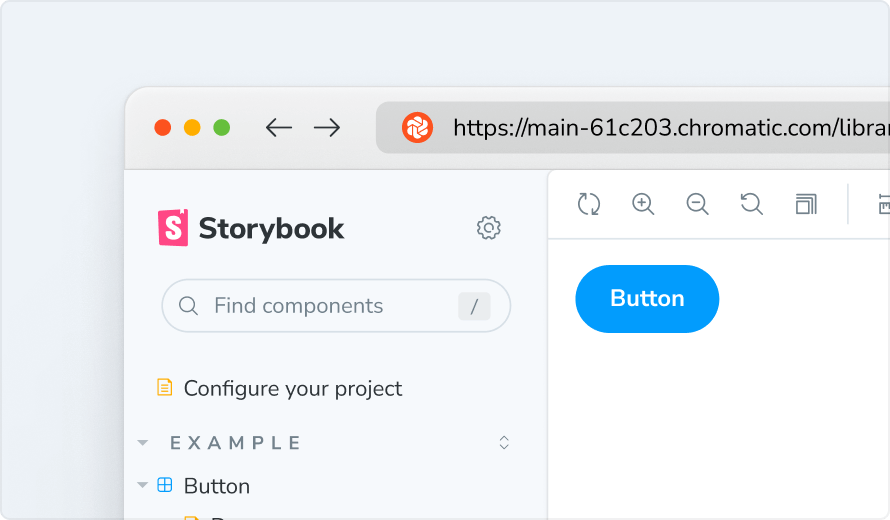
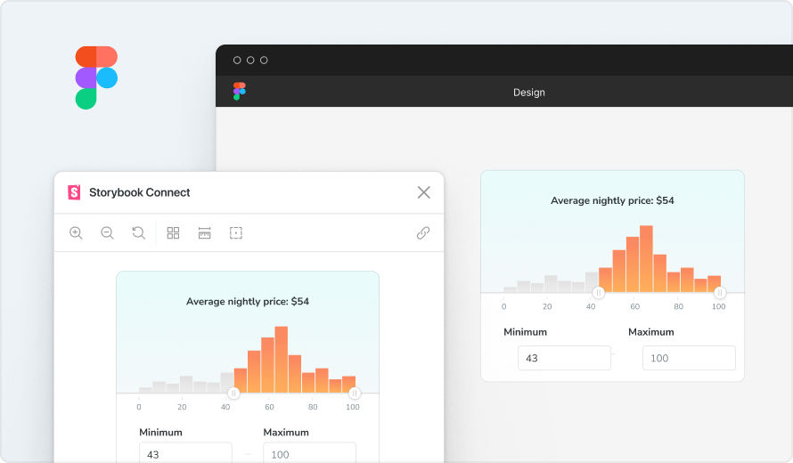
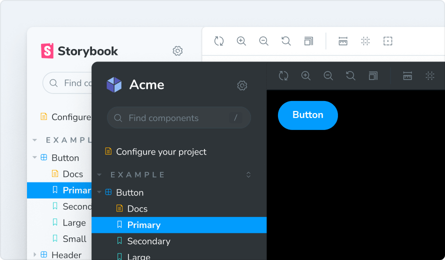

import { Meta } from "@storybook/addon-docs/blocks";
import { Source } from "@storybook/addon-docs/blocks";

export const RightArrow = () => <svg
  viewBox="0 0 14 14"
  width="8px"
  height="14px"
  style={{
    marginLeft: '4px',
    display: 'inline-block',
    shapeRendering: 'inherit',
    verticalAlign: 'middle',
    fill: 'currentColor',
    'path fill': 'currentColor'
  }}
>
  <path d="m11.1 7.35-5.5 5.5a.5.5 0 0 1-.7-.7L10.04 7 4.9 1.85a.5.5 0 1 1 .7-.7l5.5 5.5c.2.2.2.5 0 .7Z" />
</svg>

<Meta title="Introduction" />

  

    # 配置项目

    首先，您需要配置您的项目，以便可以通过 `shadcn CLI` 添加组件。你可以使用 `pnpm dlx shadcn@latest init` 命令来快速初始化一个 `NextJS + Shadcn UI + Tailwind CSS` 项目。
  

  <Source language="json" dark={true} code={
    `{
      "$schema": "https://ui.shadcn.com/schema.json",
      "style": "new-york",  
      "rsc": true,
      "tsx": true,
      "tailwind": {
        "config": "",
        "css": "app/globals.css",
        "baseColor": "neutral",
        "cssVariables": true,
        "prefix": ""
      },
      "aliases": {
        "components": "@/components",
        "utils": "@/lib/utils",
        "ui": "@/components/ui",
        "lib": "@/lib",
        "hooks": "@/hooks"
      },
      "iconLibrary": "lucide",
      "registries": {
        "@tcsk": "https://file.40017.cn/tcsk/r/H5/{name}.json"
      }
    }`
  } />

  
然后，你可以使用 `shadcn CLI` 的 `search` 命令来搜索组件，`add` 命令来添加组件。

  <Source language="bash" dark={true} code={
    `
    pnpm dlx shadcn@latest search @tcsk
    pnpm dlx shadcn@latest add @tcsk/button
    `
  } />

  

    # MCP 服务器

    为注册表启用 MCP 支持，这样你就可以在 `LLM` 中使用提示词来使用组件了。
  

  <Source language="json" dark={true} code={
    `{
      "mcpServers": {
        "shadcn": {
          "command": "npx",
          "args": ["shadcn@latest", "mcp"]
        },
      }
    }`
  } />

  
然后，你可以在 `LLM` 中使用提示词来使用组件

  <Source language="bash" dark={true} code={
    `
    Show me the components in the tcsk registry
    Create a landing page using items from the tcsk registry
    `
  } />

  

    # Storybook 使用指南

    由于 Storybook 与您的应用程序分开工作，因此您需要针对您的特定技术栈和设置对其进行配置。下面，探索使用流行框架和工具配置 Storybook 的指南。如果您遇到困难，请了解如何向我们的社区寻求帮助。
  

  

    

      
      <h4 className="sb-section-item-heading">添加样式和 CSS</h4>
      
与 Web 应用程序一样，Storybook 中包含 CSS 的方法有很多种。

      <a
        href="https://storybook.js.org/docs/configure/styling-and-css/?renderer=react&ref=configure"
        target="_blank"
      >了解更多<RightArrow /></a>
    

    

      
      <h4 className="sb-section-item-heading">提供上下文和模拟</h4>
      
通常，当故事无法呈现时，这是因为您的组件需要特定的环境或上下文可用（如主题提供程序）。

      <a
        href="https://storybook.js.org/docs/writing-stories/decorators/?renderer=react&ref=configure#context-for-mocking"
        target="_blank"
      >了解更多<RightArrow /></a>
    

    

      
      

        <h4 className="sb-section-item-heading">加载资产和资源</h4>
        
要将静态文件（如字体）链接到您的项目和故事，请使用 staticDirs 配置选项。

        <a
          href="https://storybook.js.org/docs/configure/images-and-assets/?renderer=react&ref=configure"
          target="_blank"
        >了解更多<RightArrow /></a>
      

    

  

  

    # 使用 Storybook 做更多事情

    现在您已经了解了基础知识，让我们探索 Storybook 的其他部分，这些部分将改善您的体验。此列表只是为了帮助您入门。您可以通过多种方式自定义 Storybook 以满足您的需求。
  

  

    

      

        
        <h4 className="sb-section-item-heading">自动文档</h4>
        
从您的组件和故事自动生成动态的交互式参考文档。

        <a
          href="https://storybook.js.org/docs/writing-docs/autodocs/?renderer=react&ref=configure"
          target="_blank"
        >了解更多<RightArrow /></a>
      

      

        
        <h4 className="sb-section-item-heading">发布到 Chromatic</h4>
        
发布您的故事书以审查并与整个团队协作。

        <a
          href="https://storybook.js.org/docs/sharing/publish-storybook/?renderer=react&ref=configure#publish-storybook-with-chromatic"
          target="_blank"
        >了解更多<RightArrow /></a>
      

      

        
        <h4 className="sb-section-item-heading">Figma 插件</h4>
        
将您的故事嵌入到 Figma 中，以便在一个地方交叉引用设计和实时实现。

        <a
          href="https://storybook.js.org/docs/sharing/design-integrations/?renderer=react&ref=configure#embed-storybook-in-figma-with-the-plugin"
          target="_blank"
        >了解更多<RightArrow /></a>
      

      

        
        <h4 className="sb-section-item-heading">测试</h4>
        
使用故事来测试组件的所有变体，无论其复杂程度如何。

        <a
          href="https://storybook.js.org/docs/writing-tests/?renderer=react&ref=configure"
          target="_blank"
        >了解更多<RightArrow /></a>
      

      

        
        <h4 className="sb-section-item-heading">可及性</h4>
        
在开发时自动测试组件是否存在 a11y 问题。

        <a
          href="https://storybook.js.org/docs/writing-tests/accessibility-testing/?renderer=react&ref=configure"
          target="_blank"
        >了解更多<RightArrow /></a>
      

      

        
        <h4 className="sb-section-item-heading">主题</h4>
        
主题 Storybook 的 UI 以根据您的项目对其进行个性化设置。

        <a
          href="https://storybook.js.org/docs/configure/theming/?renderer=react&ref=configure"
          target="_blank"
        >了解更多<RightArrow /></a>
      

    

  

  

    <h4 className="text-black!">插件</h4>
    
将您的工具与 Storybook 集成以连接工作流程。

    <a
        href="https://storybook.js.org/addons/?ref=configure"
        target="_blank"
      >发现所有插件<RightArrow /></a>
  

  

    
  

    

      
      成为贡献者，构建 UI 开发的未来。

      <a
        href="https://github.com/storybookjs/storybook"
        target="_blank"
      >在 GitHub 上点赞<RightArrow /></a>
    

    

      
      

        获得支持并与前端开发人员聊天。

        <a
          href="https://discord.gg/storybook"
          target="_blank"
        >加入 Discord 服务器<RightArrow /></a>
      

    

    

      
      

        观看教程、功能预览和采访。

        <a
          href="https://www.youtube.com/@chromaticui"
          target="_blank"
        >在 YouTube 上观看<RightArrow /></a>
      

    

    

      
      
跟随引导式教程进行关键工作流程。

      <a
          href="https://storybook.js.org/tutorials/?ref=configure"
          target="_blank"
        >探索教程<RightArrow /></a>
    

